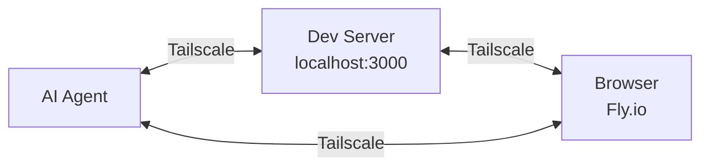

# Tailscale Chromatic

Remote browsers on your tailnet. Offload Chrome somewhere else.

## What This Enables

Headless browsers eat RAM. Chromatic runs them on Fly.io instead, but keeps them accessible through Tailscale, a private mesh network that connects your devices. Since your dev server, your AI agent, and the remote browser are all on the same tailnet, they can reach each other as if they were on the same local network.



All three can live on the same machine or anywhere on your tailnet. Browsers sleep when idle and wake on connect in about two seconds, so you only pay for what you use.

## Usage

```bash
# Setup (one-time)
nix run github:ToxicPine/tailscale-chromatic -- setup

# Create a browser
nix run github:ToxicPine/tailscale-chromatic -- create my-browser

# Configure MCP to use it
nix run github:ToxicPine/tailscale-chromatic -- mcp my-browser
```

The `mcp` command finds your `.mcp.json` and adds a Playwright server pointing at your browser's CDP endpoint. Your AI agent can now browse the web through a real Chrome instance.

## Architecture

A **browser group** is a pool of machines, each running an independent Chrome instance. When you connect to the group's CDP endpoint, Fly.io routes you to one of the available machines.

```
chromatic create scrapers           # 1 machine by default
chromatic create scrapers --count 3 # 3 machines
chromatic scale scrapers 5          # scale to 5 machines
```

This is designed for **stateless** usage: connect, browse, disconnect. Each connection may hit a different machine. For sticky sessions to a specific machine, use `chromatic status <name>` to see per-machine IPs.

Machines sleep when idle and wake on connect (~2 seconds). You only pay while they're running.

## Commands

```
chromatic setup            One-time setup: connect Fly.io and Tailscale, deploy router
chromatic create <name>    Create a new remote browser group on Fly.io
chromatic list             List all browsers and their status
chromatic status <name>    Show browser group details including machines and endpoints
chromatic scale <name>     Add or remove machines in a browser group
chromatic mcp <name>       Add a browser to your .mcp.json for AI agents
chromatic destroy <name>   Delete a browser group and all its machines
chromatic router           Manage the Tailscale subnet router (status, redeploy, destroy)
chromatic doctor           Check that Tailscale and the router are working correctly
```

## Cost

The router runs continuously at about $2.50/mo. Browser instances cost roughly $0.01/hr while running and nothing while frozen.

## Requirements

- [Fly.io](https://fly.io) account
- [Tailscale](https://tailscale.com) account
