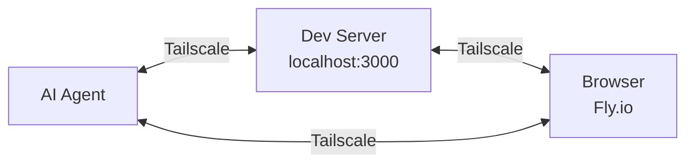

# Tailscale Chromatic

Run headless browsers in the cloud that can still access your localhost.

## What It Does

Headless browsers consume massive amounts of RAM and CPU. Chromatic runs them on the cloud instead to keep your machine fast.

Unlike standard cloud browsers, these instances can securely access servers running on your local machine (e.g., `http://my-laptop:3000`) without you needing to configure public tunnels or expose ports.

You get the performance of the cloud with the seamless access of a local browser.

It is built on Tailscale, and supports the MCP protocol.



Your cloud browsers sleep when idle and wake just-in-time to handle requests, in about two seconds, so you only pay for each browser whilst you're using it.

## Usage

```bash
# Setup (one-time)
nix run github:ToxicPine/tailscale-chromatic -- setup

# Create a browser
nix run github:ToxicPine/tailscale-chromatic -- create my-browser

# Configure MCP to use it
nix run github:ToxicPine/tailscale-chromatic -- mcp my-browser
```

The `mcp` command finds your `.mcp.json` and adds a Playwright server pointing at your browser's CDP endpoint. Your AI agent can now browse the web through a real Chrome instance.

## Commands

```
chromatic setup            One-time setup: connect Fly.io and Tailscale, deploy router
chromatic create <name>    Create a new remote browser
chromatic list             List all browsers and their statuses
chromatic status <name>    Show browser details including machines and endpoints
chromatic scale <name>     Add or remove machines in a browser group
chromatic mcp <name>       Add a browser to your .mcp.json for AI agents
chromatic destroy <name>   Delete a browser group and all its machines
chromatic router           Manage the Tailscale subnet router (status, redeploy, destroy)
chromatic doctor           Check that Tailscale and the router are working correctly
```

## Cost

The router runs continuously at about $2.50/mo. Browser instances cost roughly $0.01/hr while running and nothing while frozen.

## Requirements

- [Fly.io](https://fly.io) account
- [Tailscale](https://tailscale.com) account
